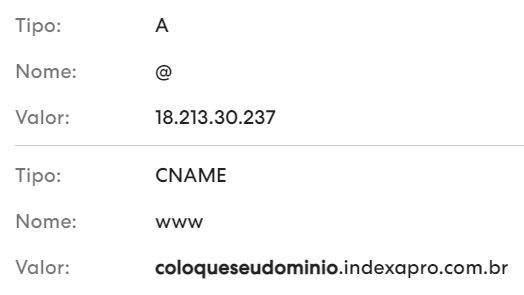

# Definir um domínio personalizado para meu site Indexa

Por padrão, seu site já tem um domínio **indexapro.com.br**, porém, é possível que você queria que seu site seja acessível de algum outro domínio, como por exemplo **minhaempresa.com.br**.

Para definir um domínio personalizado, você deve acessar o site onde você comprou seu domínio e insirir algumas linhas nas configurações de DNS. Calma, é fácil, vamos te explicar como realizar este processo e o que são DNSs.

## O que é apontamendo de DNS?
Os apontamentos são responsáveis por direcionar um site ou e-mail para um determinado servidor.

Então neste caso, os apontamentos irão direcionar o seu domínio próprio para o servidor da Indexa. Assim, quando alguém acessar o seu endereço, será encaminhado diretamente para seu site na Indexa.

Desta forma, após contratar um domínio, você vai precisar criar alguns apontamentos para seu site. Este processo, basicamente, consiste no cadastro de dois apontamentos DNS, um do tipo A, e outro do tipo CNAME.

### Apontamento tipo A
O apontamento tipo A, também chamado de hostname, é o principal registro de um domínio. Ele é responsável por manter o site online, sempre o associando a um endereço de IP.

Aqui, este apontamento irá ligar o seu endereço próprio ao servidor da Indexa.

### Apontamento tipo CNAME
Já o apontamento CNAME é responsável por fazer a conexão dos endereços através dos nomes (domínio próprio e domínio compartilhado).

Ele funciona como um redirecionamento, então aqui, ele irá garantir que o usuário possa acessar a seu site sem que seja necessário utilizar o domínio compartilhado.

## DNS da Indexa
Acesse o site onde você comprou seu domínio e insira as seguintes linhas em suas configurações de DNS.

**Lembre-se de de mudar o "coloqueseudominio" pelo seu dominio da Indexa.**

## Adicionando linha DNS - GoDaddy
<a href="https://br.godaddy.com/help/gerenciar-os-registros-dns-680" target="_blank">Clique aqui e saiba como.</a>

## Adicionando linha DNS - Registro.br
<a href="https://registro.br/ajuda/gerenciamento-de-conta/funcoes-contato-do-titular" target="_blank">Clique aqui e saiba como.</a>

## Adicionando linha DNS - Hostgator
<a href="https://suporte.hostgator.com.br/hc/pt-br/articles/115000389554-Como-criar-ou-alterar-um-registro-MX-TXT-CNAME-e-outros-na-zona-DNS" target="_blank">Clique aqui e saiba como</a>

## Vincular seu domínio ao seu site Indexa

Agora que você já inseriu as linhas de DNS necessárias, vamos vincular o domínio que você comprou à sua conta Indexa, para isso, você deverá acessar [Painel do Cliente > Meu Site > Meus Domínios](https://indexapro.com.br/dashboard/meus-dominios).

## Tempo de vinculação

Após a criação das linhas de DNS, a vinculação entre seu domínio personalizado e o seu site Indexa pode demorar até 3 dias para acontecer.