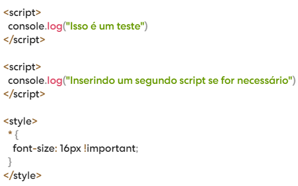

# Integrações

Você pode integrar seu site Indexa com ferramentas como Google Analytics, Meta Pixel, você também pode desenvolver scripts e estilos e injetá-los em seu site.

Normalmente ferramentas que gerem tráfego como as citadas acima, solicitam a inserção de um código na tag "head" do seu site, para realizar este processo em seu site Indexa você pode acessar [Painel do Cliente > Avançado > Integrações](https://indexapro.com.br/dashboard/integracoes), copiar e colar o código necessário e clicar em **"Salvar"** no canto inferior da tela.

Exemplo:

**Importante:** Realize este processo com cuidado para evitar mau funcionamento do seu site, ou até mesmo tirá-lo do ar.
